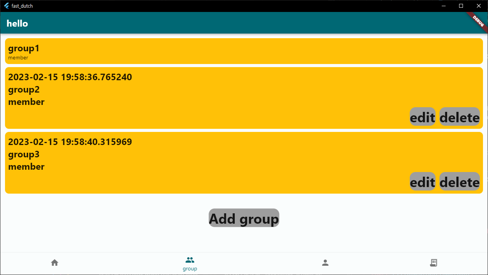

# [fast_dutch](https://github.com/hoseCloud/fast_dutch)

**fast_dutch는 더치페이를 깔끔하게** 해주는 애플리케이션입니다.  
플러터를 이용한 개인프로젝트 입니다.

## 기능

1. 모임 관리
   1. 영수증이 섞이지 않음
   2. 인원을 추가해 관리 용이
   3. 모임의 더치페이 계산
2. 인원 관리
   1. 자주 만나는 사람을 저장
   2. 터치로 인원을 추가
3. 영수증 관리
   1. 빠르게 입력가능한 영수증
   2. 필요한 정보만 알잘딱깔센
