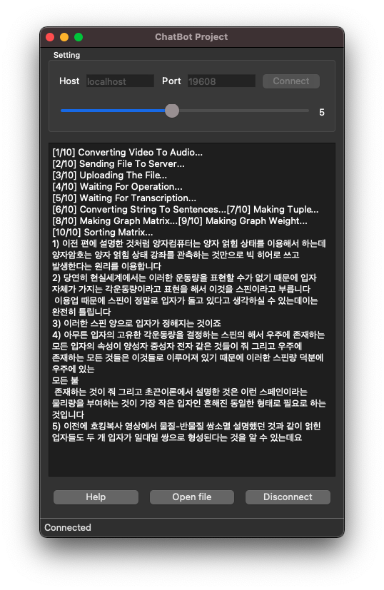

# [ClipSill](https://github.com/hoseCloud/ClipSill)

**ClipSill은 동영상에서 핵심 내용을 추출**하여 요약해주는 프로그램입니다.  
Clip과 Essential을 합쳐서 만든 이름입니다.  
대학생 3학년 1학기 컴퓨터네트워크 팀프로젝트 입니다.



## 기능

1. 동영상의 핵심 내용을 추출할 수 있다.
2. 추출할 문장의 수를 조절할 수 있다.

## 구현 방법

1. 영상(.MP4) → 음성(.MP3)
   - python moviepy 모듈을 사용
2. 음성(.MP3) → 문자(.txt)
   - Google Speech-to-Text API 사용
3. 문자(.txt) → 핵심 문장
   - TextRank 알고리즘을 구현해 추출

## 팀원

- [hoseCloud](https://github.com/hoseCloud)
    - Google Speech-to-Text API 연동
- [N0N4M3D_b](https://github.com/N0N4M3D-b)
    - TextRank 구현
- [g3un](https://github.com/g3un)
    - 채팅 및 GUI 구현

## 설치 방법

**저장소의 API key 기간이 만료되어 사용할 수 없습니다.**  
**개인이 Google의 Speech-to-Text API 키를 발급받아야 합니다.**

1. Python 3.7 버전을 사용해야합니다.
2. 아래 명령어를 통해 모듈을 설치해주세요.

```bash
pip install -U pip
pip install -U -r requirements.txt
```

3. 아래 명령어를 통해 json 파일을 환경변수에 등록해주세요.

```bash
export GOOGLE_APPLICATION_CREDENTIALS=key.json
```
