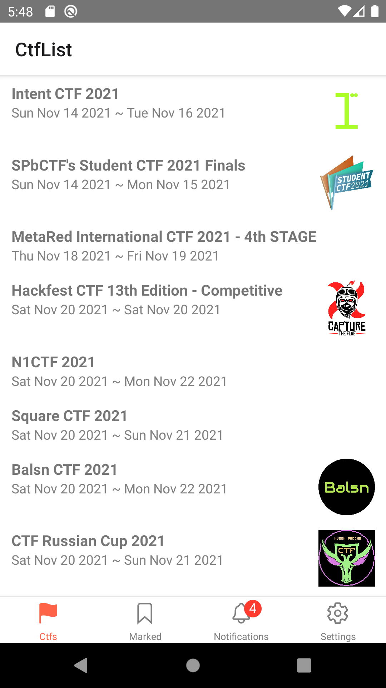
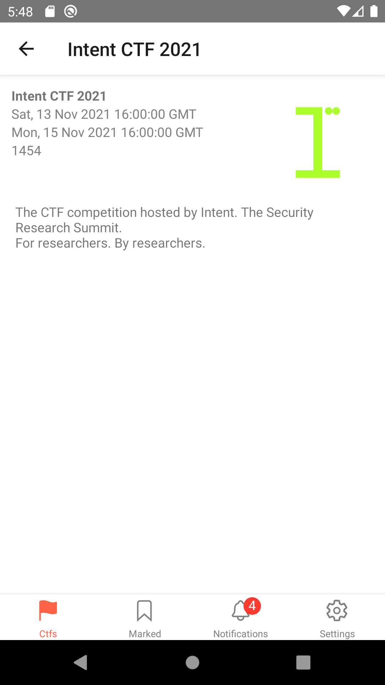
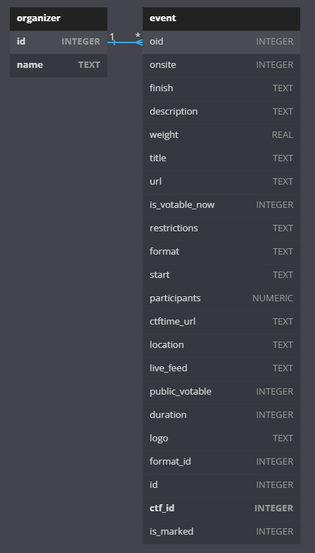

# [CtfList](https://github.com/g3un/sp2-term)

**모바일로 Ctf 목록들을 쉽게 확인하고 일정을 관리**할 수 있는 애플리케이션입니다.  
CTF 일정을 List 형식으로 보여주기 때문에 CtfList입니다.  
대학생 3학년 2학기 소프트웨어설계및실습2 팀프로젝트 입니다.

## 기능

1. [ctftime.org](https://ctftime.org/)에 등록된 모든 CTF 일정을 확인할 수 있다.
2. CTF 이름으로 빠르게 검색할 수 있다.
3. 관심 있는 CTF를 즐겨찾기 할 수 있다.

## 구현 방법

1. CTF 목록을 [ctftime.org](https://ctftime.org/) API를 이용해 얻음
2. 얻은 데이터를 가공해 DB에 저장 후 화면에 출력

## 팀원

- [hoseCloud](https://github.com/hoseCloud)
  - 데이터 가공 및 DB 설계
- [N0N4M3D_b](https://github.com/N0N4M3D-b)
  - 데이터 수집(API) 및 필터링
- [g3un](https://github.com/g3un)
  - 디자인 및 이벤트 관리
