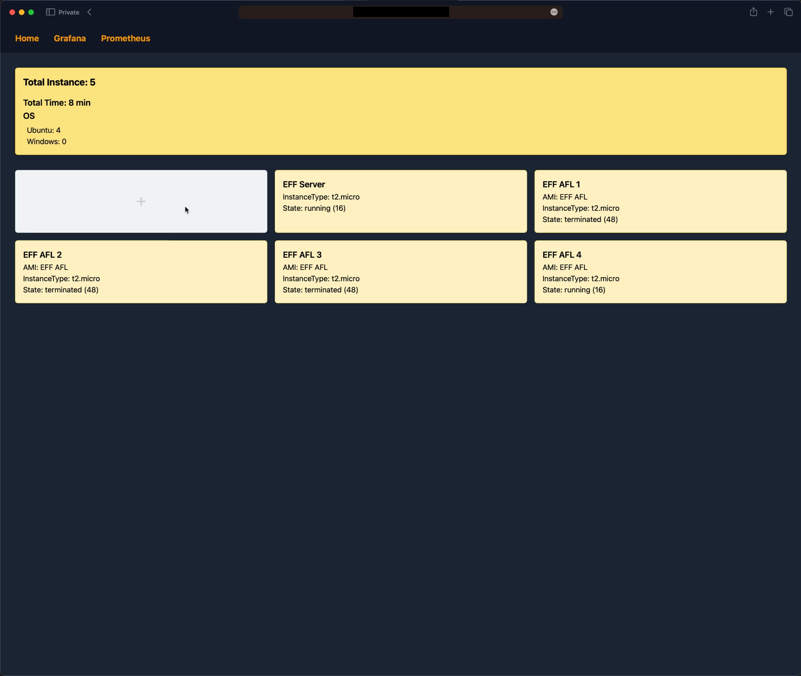
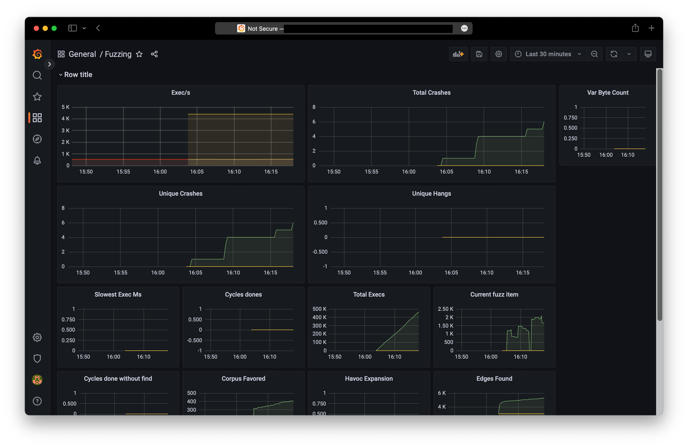

# [Easy Fuzzer Framework](https://github.com/g3un/easy-fuzzer-framework)

**퍼저를 사용하기 쉽게 GUI로 구현**할 수 있는 프레임워크입니다.  
사용하기 어려운 퍼저를 쉽게 사용할 수 있다는 의미의 이름이다.  
대학생 4학년 2학기 소프트웨어 프로젝트2 팀프로젝트 입니다.

## 기능

1. AWS EC2에 퍼저가 설치된 인스턴스를 자동 생성할 수 있다.
2. 퍼징데이터를 대시보드에서 한 번에 확인할 수 있다.
3. 원하는 퍼징데이터를 필터하거나 그래프 형태를 변경해 사용자가 보기 편하게 설정할 수 있다.

## 구현 방법

1. AWS EC2 API를 이용해 인스턴스를 생성한다.
2. 생성된 인스턴스를 대시보드와 연결해 데이터를 받는다.
3. 받은 데이터를 가공해 대시보드에 표시한다.

## 팀원

- [hoseCloud](https://github.com/hoseCloud)
  - 프로젝트 매니저
- [g3un](https://github.com/g3un)
  - 핵심 기능 구현 및 API 제작
- [cjh4629](https://github.com/cjh4629)
  - 화면 설계 및 디자인
