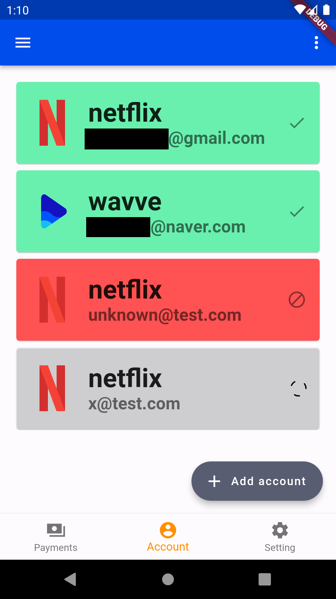

# [OTTally](https://github.com/hoseCloud/sp1-frontend)

**OTT 구독 관리를 쉽게할 수 있는 애플리케이션**입니다.  
OTT + Ally(동료) 또는 OTT + tally(계산)의 의미를 가지고 있습니다.  
대학생 4학년 1학기 소프트웨어 프로젝트1 팀프로젝트 입니다.

## 기능

1. OTT 계정을 입력해 구독 현황을 추적할 수 있다.
2. 계정의 구독 현황을 애플리케이션에서 변경할 수 있다.
3. 다음 달에 결제되는 총금액을 확인할 수 있다.

## 구현 방법

1. OTT 계정을 입력받아 공식 홈페이지에서 구독 현황을 가져온다.
2. 구독 현황을 애플리케이션에 표시한다.
3. 구독 금액을 모두 합산해 표시한다.

## 팀원

- [hoseCloud](https://github.com/hoseCloud)
  - 화면 설계 및 구현
- [N0N4M3D_b](https://github.com/N0N4M3D-b)
  - DB 설계 및 구현
- [g3un](https://github.com/g3un)
  - API 제작 및 테스트
- [cjh4629](https://github.com/cjh4629)
  - 프로젝트 매니저
