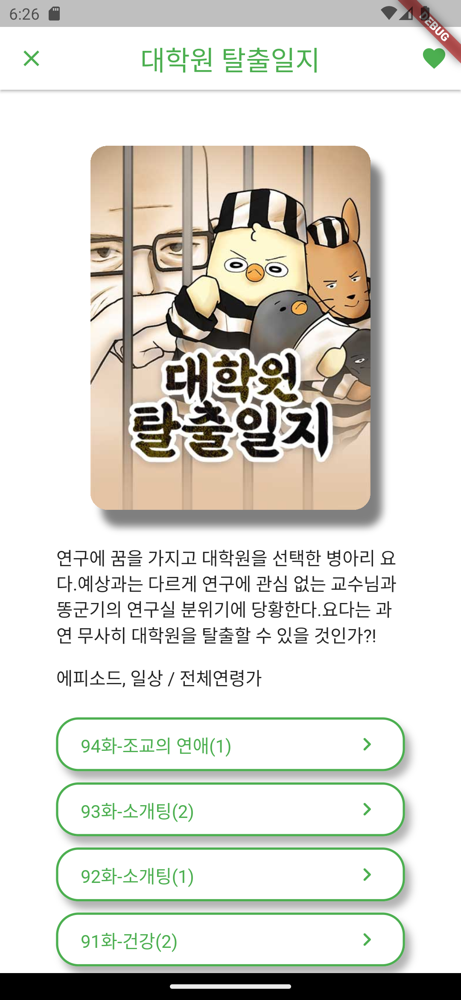

# [practice_flutter](https://github.com/hoseCloud/practice_flutter)

모바일에서 동작하는 웹툰 뷰어입니다.

Flutter 연습을 위한 개인 저장소입니다.  
그리고 [강의(dart)](https://nomadcoders.co/dart-for-beginners/lobby)와 [강의(flutter)](https://nomadcoders.co/flutter-for-beginners/lobby)를 제공해준 **nomad coders**에게 감사합니다!

## 기능

1. 웹툰의 목록을 확인할 수 있다.
2. 각 웹툰의 세부 정보를 볼 수 있다.
3. 웹툰을 즐겨찾기를 할 수 있다.
4. 각 웹툰의 에피소드를 볼 수 있다.
