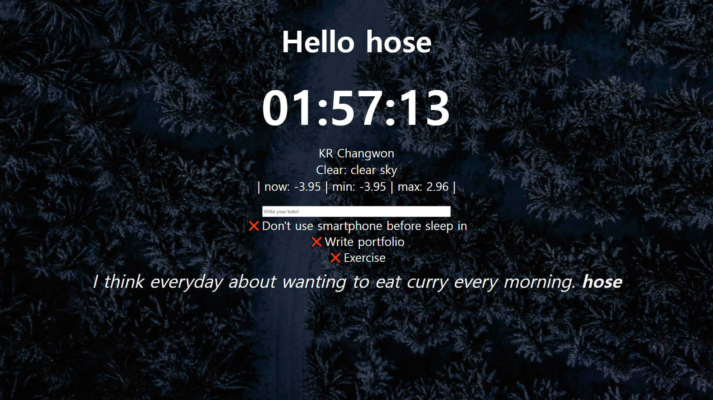

# [practice_js](https://github.com/hoseCloud/practice_js)

JavaScript 연습을 위한 개인 저장소입니다.  
여기 [링크](https://hosecloud.github.io/practice_js/)가 있습니다.

그리고 [강의](https://nomadcoders.co/javascript-for-beginners/lobby)를 제공해준 **nomad coders**에게 감사합니다!

## 기능

1. 이름으로 로그인이 가능하다.
2. 각 이름별로 TODO 목록을 만들 수 있다.
3. 5개의 배경화면이 랜덤으로 나타난다.
4. 5개의 명언이 랜덤으로 나타난다.
5. 현재 위치와 날씨를 볼 수 있다.
